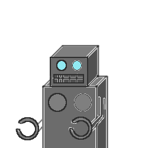
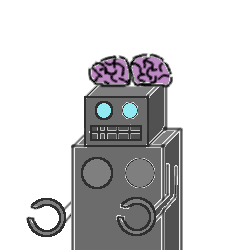

# suijaku
大貧民（追加ルールなし＋NPC機械学習） 
## 特徴
・8切りやスぺ3など、姑息なルールはありません 
・NPCに一部、ニューラルネットワークを使用した学習機能付きの者がいます。（「NPCを鍛える」モードで調教可能）
## usage
・まず「NPCを鍛える」でNPCを鍛えてください。
### ｽﾀｰﾄ（通常遊び）
クリックすると、キャラクター選択画面に遷移する。 
キャラクターをクリックすると、キャラクターの枠が黄色くハイライトされ、選択されたことになる。選択を解除したい場合はもう一度クリックする。
#### キャラ
・雑魚…出せるカードを手当たり次第に出す 
・強い…強いカードを出し惜しみして、最後の方（ほかのプレイヤーが上がりそうになったら）に出す 
・NeuralNetwork…選択肢がカード単位（output関数：sigmoid、神経多いバージョン/ReLu）、出せるカードBrain
  
「ゲーム開始」ボタンを押すと、ゲームが開始される。

  [マーク|数字]はトランクのカードを現す。クリックすると蒼くハイライトとされ、選択されたことになる。長押しで場に出せる。2枚以上出したい場合は、複数選択された状態で長押しすること。
### NPCを鍛える
ニューラルネットワークのNPCの脳を鍛える。キャラ選択で育てたいキャラを選択する。 
カードを場に出す際に、ポップアップ画面が表示される。現在の脳でNPCが選択したカードが表示される。自分が出したかったカードと異なる場合は、「ラーン」を押して自分が出したカードを出せるように学習させよう。 ある程度学習したら、SAVEボタンを押してNPCの脳の状態を保存すること。
### NPCの成長具合
ニューラルネットワークにより実装されたNPCのニューロンの状態を視認することが出来る。パラメータが無限大に発散してしまった場合は、リセットボタンも着いている。

## to be updated
・NNBbrain_almighty 入力値全てのカード(52枚)に対して。： 
　場にでてる…'2' 
　自分が持っている…'1' 
　まだ出ていない…'0' 
　出た…'-1' 

